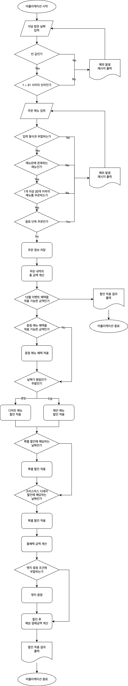

## 🎁 프리코스 4주차 : 크리스마스 프로모션 미션 개요
### 크리스마스 프로모션은 아래와 같은 규칙을 기반으로 진행됩니다
저희 우테코 식당에서는 아래와 같이 12월 한 달간(12.1 ~ 12.31) 할인 이벤트를 진행합니다.
해당 할인 이벤트를 적용하는 이벤트 플래너를 만들어 주세요.
```
- 평일(일요일 ~ 목요일)에는 디저트 메뉴를 메뉴 1개당 2,023원 할인합니다
- 주말(금요일 ~ 토요일)에는 메인 메뉴를 메뉴 1개당 2,023원 할인합니다
- 매주 일요일과, 크리스마스 당일에 방문하시는 경우 총주문 금액에서 추가 1,000원 할인합니다

<증정 이벤트!>
할인 전 총주문 금액이 120,000원 이상인 경우 25,000원 상당의 샴페인 1개를 증정합니다!

<12월 1일에서 12월 25까지 진행되는 크리스마스 디데이 추가 할인> (* 12월 이벤트 할인과 중복 가능합니다)
- 1일에는 1,000원으로 시작하여 날마다 할인 금액이 100원씩 증가합니다.
- 총주문 금액에서 해당 금액만큼 할인해 드립니다.

<이벤트 배지 부여>
다가올 2024 새해 이벤트에서 사용할 수 있는 이벤트 배지를 나눠드립니다.
- 이번 크리스마스 프로모션에서 혜택을 얼마나 받으셨는지 총혜택 금액에 따라 이벤트 배지를 부여해 드립니다.
  - 5천원 이상의 혜택을 받으신 경우 : 별 배지
  - 1만원 이상의 혜택을 받으신 경우 : 트리 배지
  - 2만원 이상의 혜택을 받으신 경우 : 산타 배지
  
<이벤트 주의 사항>
- 총주문 금액 10,000원 이상부터 이벤트 적용 대상입니다.
- 음료만 주문할 수 없습니다.
- 메뉴는 한 번에 최대 20개까지만 주문 가능합니다.
```

## 🎄구현할 기능 목록

> 예약된 메뉴에 할인 이벤트를 적용하여 안내하는 어플리케이션 제작하기

### 식당 메뉴 저장 및 관리하는 기능
- 식당의 메뉴를 저장 및 관리해야 함
### 사용자에게 식당 방문 날짜(일) 입력 받는 기능
- 입력값이 숫자인지 (예외처리)
- 입력값이 1 ~ 31 사이인지 (예외처리)
- 빈 값이 들어오는지 (예외처리)
- 예외처리 메시지는 다음과 같다 : ```[ERROR] 유효하지 않은 날짜입니다. 다시 입력해 주세요.```
- 유효하지 않은 입력이 발생하는 경우, 예외처리 메시지 작성 후 다시 날짜를 입력받아야 함
### 사용자에게 주문할 메뉴 입력 받는 기능
- '메뉴이름-수량' 의 형식으로 입력받아야 함 (예외처리)
- 빈 값이 들어오는지 (예외처리)
- 예외처리 메시지는 다음과 같다 : ```[ERROR] 유효하지 않은 주문입니다. 다시 입력해 주세요.```
- 유효하지 않은 입력이 발생하는 경우, 예외처리 메시지 작성 후 다시 메뉴를 입력받아야 함
### 주문받은 메뉴를 알맞게 저장 및 관리하는 기능
- 메뉴판에 존재하는 메뉴만 저장할 수 있음 (예외처리)
- 메뉴는 최소 1개 이상 주문되어야 함 (예외처리)
- 메뉴는 한 번에 최대 20개까지만 주문 가능 (예외처리)
- 음료만 단독으로 주문할 수 없음 (예외처리)
- 예외처리 메시지는 다음과 같다 : ```[ERROR] 유효하지 않은 주문입니다. 다시 입력해 주세요.```
- 유효하지 않은 메뉴를 저장하려는 경우, 예외처리 메시지 작성 후 다시 메뉴를 입력받아야 함
### 주문받은 메뉴의 할인 전 총주문 금액을 계산하는 기능
- 주문받은 메뉴의 값을 모두 더하여 총주문 금액을 계산하기
### 혜택 적용 가능한지 판별하는 기능
- 총주문 금액 10000원 이상부터 이벤트 적용 대상
### 증정 메뉴 조건에 해당하는지 판단하는 기능
- 할인 전 총주문 금액이 12만원 이상일 때, 샴페인 1개 증정
### 적용 가능한 할인 혜택 적용하는 기능
- 12월 이벤트 할인
  - 12월 1일 ~ 12월 31일 동안 진행되는 할인
  - 평일(일요일 ~ 목요일) 할인
      - 디저트 메뉴를 메뉴 1개당 2023원 할인
  - 주말(금요일 ~ 토요일) 할인
      - 메인 메뉴를 메뉴 1개당 2023원 할인
  - 특별 할인
      - 주문 날짜가 3일, 10일, 17일, 24일, 31일, 25일인 경우 총주문 금액에서 1000원 할인
- 크리스마스 디데이 할인
  - 12월 1일 ~ 12월 25일 동안 진행되는 할인
  - 첫날에는 할인 금액이 1000원으로 시작하여 날마다 할인 금액이 100원씩 증가 (1000, 1100, 1200..)
  - 총주문 금액에서 해당 금액만큼 할인
  - 12월 이벤트 할인과 중복 할인 가능
### 총혜택 금액을 계산하는 기능
- 할인 금액의 합계 + 증정 메뉴의 가격
### 할인 후 예상 결제 금액을 계산하는 기능
- 할인 전 총주문 금액 - 할인 금액
### 이벤트 배지를 부여하는 기능
- 총혜택 금액이 다음과 같을 경우 배지를 부여한다
  - 5천원 이상 : 별
  - 1만원 이상 : 트리
  - 2만원 이상 : 산타
### 이벤트 혜택 출력하는 기능
- 주문 메뉴 정보 출력하기
- 할인 전 총주문 금액 정보 출력하기
- 증정 메뉴 정보 출력하기
  - 해당되지 않는 경우 없음 으로 출력
- 혜택 내역 정보 출력하기
  - 적용된 이벤트 내역만 출력
  - 적용된 이벤트가 없다면 없음 으로 출력
  - 증정 이벤트로 샴페인을 받은 경우, 혜택 내역에 출력해주어야 함
- 총혜택 금액 정보 출력하기
- 할인 후 예상 결제 금액 정보 출력하기
- 12월 이벤트 배지 내용 정보 출력하기
  - 배지가 부여되지 않는 경우 없음 으로 출력

## 💡 어플리케이션 흐름 플로우차트로 정리해보기


## 📋 주요 비즈니스 로직 담당하는 클래스 소개
| 클래스명             | 클래스 설명                         |
|------------------|-------------------------------|
| Date             | 예약받은 날짜에 관련된 일을 담당하는 클래스      |
| ChristmasDiscounter | 크리스마스 디데이 할인을 담당하는 클래스        |
| DecemberDiscounter | 12월 평일/주말 할인을 담당하는 클래스        |
| SpecialDiscounter | 특별 할인을 담당하는 클래스               |
| RestaurantWaiter | 입력받은 메뉴를 저장하고 관리하는 클래스        |
| StringMaker      | 할인 받은 내역들을 출력하기 위한 역할을 하는 클래스 |
| Gift             | 증정 이벤트에 관한 일을 담당하는 클래스        |